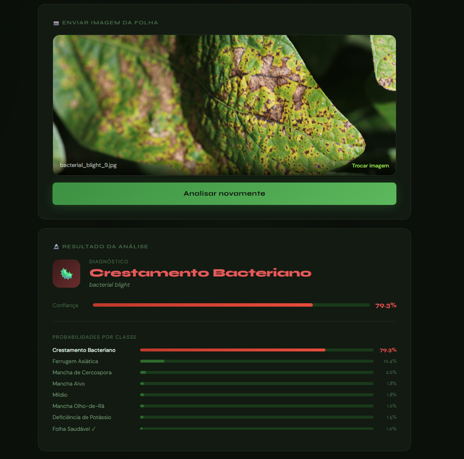
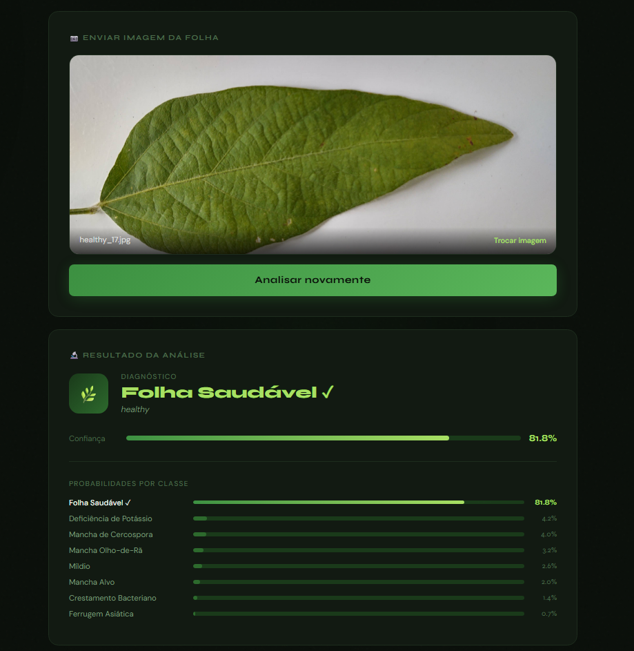

# Sistema de Triagem de Doenças Foliares em Soja (SojaVision) 🌿

Este repositório serve como portfólio e documentação do meu Trabalho de Conclusão de Curso em Sistemas de Informação, focado no desenvolvimento de um sistema de Visão Computacional para apoiar o diagnóstico fitossanitário no agronegócio.

> **⚠️ Nota de Propriedade Intelectual:** O código-fonte deste projeto (arquivos `.py`, scripts de treinamento e estruturação da API) encontra-se em um repositório privado para proteção do trabalho acadêmico. Caso tenha interesse profissional ou acadêmico em discutir a arquitetura de código, sinta-se à vontade para entrar em contato.

## 🎯 Visão Geral
A cultura da soja é estratégica para o Brasil, mas sofre perdas severas devido a doenças foliares. Este projeto propõe uma solução acessível baseada em Inteligência Artificial, capaz de classificar oito diferentes patologias a partir de imagens reais capturadas em campo, servindo como suporte à tomada de decisão agrícola.

## 🧠 Arquitetura e Tecnologias
O modelo foi construído do zero (sem uso de redes pré-treinadas), garantindo total controle arquitetural e baixo custo computacional.
* **Deep Learning:** TensorFlow e Keras.
* **Arquitetura Customizada:** Rede Neural Convolucional (CNN V7) com integração nativa do Módulo de Atenção Convolucional (CBAM), que foca o aprendizado nas regiões exatas das lesões foliares.
* **Backend e API:** FastAPI encapsulando o modelo para inferência em alta performance.
* **Frontend:** Interface desenvolvida em HTML, CSS e JavaScript para consumo direto da API.

## 📊 Resultados e Métricas
O modelo foi treinado e avaliado utilizando o dataset ASDID (Auburn Soybean Disease Image Dataset). Através da aplicação de *Test-Time Augmentation (TTA)*, o sistema alcançou métricas altamente consistentes:
* **Acurácia Global:** 94%
* **Macro F1-Score:** 0.94

## 🖥️ Demonstração da Interface
Abaixo, exemplos do sistema processando o diagnóstico de folhas com patologias e folhas saudáveis, retornando o nível de confiança e as probabilidades das classes:

## 📄 Documentação Completa
Para uma análise profunda sobre a metodologia, o pipeline de dados com paralelismo e a análise qualitativa dos resultados, leia a monografia completa anexada neste repositório:
👉 [Acessar o TCC (PDF)](./Trabalho_de_Conclusão_de_Curso_-_Rafael_Ferreira_Lucena.pdf)
